# Governance Audit: Requirements-Workshop Artifact Plan with Phase+State Tracking

**Audit Date**: 2026-03-07  
**Auditor**: AI Governance Reviewer  
**Scope**: Review-only — no code or doc changes  
**Repo**: `ai-agent-governance`  

---

## 1. Audit Summary

This audit evaluates whether the repo satisfies the **requirements-workshop governance artifact plan** with **Phase+State tracking** as described in the audit baseline. The assessment covers 10 functional requirements, 5 non-functional requirements, 4 constraints, 3 dependencies, 4 risks, and 7 acceptance criteria.

### Overall Verdict: **FAIL — Significant Gaps**

The repo has a solid foundational governance framework (merge-by-command protocol, tracker-based workflow, quality gates, STOP checks). However, **the requirements-workshop governance layer does not exist**. No workshop workflow, no workshop template, no Phase+State model in the tracker, and no cross-doc references to workshop artifacts are present. Of the 10 functional requirements, **all 10 fail**. Of the 7 acceptance criteria, **6 fail outright and 1 is partial**.

### Scoped Files Inspected

| File | Exists | Size |
|------|--------|------|
| [`AGENTS.md`](AGENTS.md) | ✅ | 45 lines |
| [`.agent/workflows/governance.md`](.agent/workflows/governance.md) | ✅ | 89 lines |
| [`.agent/workflows/merge-pr.md`](.agent/workflows/merge-pr.md) | ✅ | 77 lines |
| [`docs/development/delivery-governance.md`](docs/development/delivery-governance.md) | ✅ | 58 lines |
| [`docs/tracker.md`](docs/tracker.md) | ✅ | 68 lines |
| [`docs/templates/tracker-template.md`](docs/templates/tracker-template.md) | ✅ | 14 lines |
| [`docs/README.md`](docs/README.md) | ✅ | 19 lines |
| [`README.md`](README.md) | ✅ | 211 lines |
| [`.github/pull_request_template.md`](.github/pull_request_template.md) | ✅ | 17 lines |
| `.agent/workflows/requirements-workshop.md` | ❌ | — |
| `docs/templates/requirements-workshop-template.md` | ❌ | — |
| `docs/examples/*` | ❌ | — |

---

## 2. Findings (by Severity)

### Critical

#### AUD-001 — Requirements workshop workflow missing entirely

| Field | Value |
|-------|-------|
| **Requirement(s)** | FR-002, AC-002, R-002 |
| **Evidence** | `.agent/workflows/` contains only `governance.md` and `merge-pr.md` — no `requirements-workshop.md` |
| **Why it matters** | The workshop workflow is the foundational artifact for the entire requirements-workshop governance plan. Without it, no pre-coding workshop gate can exist, no workshop traceability is possible, and governance drift for requirements is unmitigated. |
| **Minimal fix** | Create `.agent/workflows/requirements-workshop.md` with: trigger conditions, applicability rules distinguishing feature work from hotfix/minor, step-by-step workshop facilitation flow, output artifact reference, exception path with approver + due date. |

#### AUD-002 — Requirements workshop template missing entirely

| Field | Value |
|-------|-------|
| **Requirement(s)** | FR-003, NFR-002, NFR-003, AC-002 |
| **Evidence** | `docs/templates/` contains only `tracker-template.md` — no `requirements-workshop-template.md` |
| **Why it matters** | Without a deterministic template, workshop outputs are unstructured and unauditable. Traceability fields — ID, source role, priority, acceptance condition — cannot be enforced. |
| **Minimal fix** | Create `docs/templates/requirements-workshop-template.md` with mandatory sections: metadata block, participant roles, requirement rows with ID/source-role/priority/acceptance-condition fields, decision log, open questions, and placeholder/redaction guidance. |

#### AUD-003 — Phase+State model absent from tracker and tracker template

| Field | Value |
|-------|-------|
| **Requirement(s)** | FR-001, AC-001 |
| **Evidence** | [`docs/tracker.md`](docs/tracker.md:7) line 7 defines status as `Open → Planned → In Progress → Done or Blocked`. [`docs/templates/tracker-template.md`](docs/templates/tracker-template.md:7) line 7 mirrors this. Neither includes a Phase column or Phase+State composite. |
| **Why it matters** | The Phase+State model is the primary tracking innovation required by the plan. Without it, status progression cannot distinguish which lifecycle phase an item is in — e.g., `Requirements:In Progress` vs `Implementation:In Progress`. |
| **Minimal fix** | Add a `Phase` column to the tracker table and template. Define canonical phases (e.g., Requirements, Design, Implementation, Validation, Release). Update the How to Use section to document the `Phase:State` progression model. Ensure backward compatibility per CON-003 by making Phase optional for existing entries. |

#### AUD-004 — AGENTS.md STOP checks have no workshop gate

| Field | Value |
|-------|-------|
| **Requirement(s)** | FR-004, AC-003 |
| **Evidence** | [`AGENTS.md`](AGENTS.md:7-13) lines 7-13: STOP checks cover tracker, assigned ID, docs sync, branch, feature/issue sequence. No check for workshop artifact completion. |
| **Why it matters** | AGENTS.md is the non-negotiable rules file consumed by AI agents. Without a workshop STOP check, agents will proceed to coding without verifying that requirements have been workshopped for feature-level work. |
| **Minimal fix** | Add a STOP check: **Workshop complete?** For feature-level work, is the requirements workshop artifact linked in the tracker? Include documented exception path. |

#### AUD-005 — Governance workflow has no pre-coding workshop check

| Field | Value |
|-------|-------|
| **Requirement(s)** | FR-005, AC-003 |
| **Evidence** | [`.agent/workflows/governance.md`](.agent/workflows/governance.md:12) line 12: Before coding check only verifies tracker ID assignment and In Progress status. |
| **Why it matters** | The governance workflow is the operational enforcement layer. Without a pre-coding workshop completion check, the workshop requirement has no enforcement point. |
| **Minimal fix** | Add to the Before coding row: Is workshop artifact complete or exception documented? for feature-level work. |

#### AUD-006 — Delivery governance DOD lacks workshop traceability

| Field | Value |
|-------|-------|
| **Requirement(s)** | FR-006, AC-003 |
| **Evidence** | [`docs/development/delivery-governance.md`](docs/development/delivery-governance.md:48-58) lines 48-58: DOD criteria cover implementation, tests, lint, build, security, docs, PR merge, tracker update. No workshop traceability criterion. |
| **Why it matters** | The Definition of Done is the final quality gate. If workshop traceability is not in the DOD, completed work can ship without verified requirements alignment. |
| **Minimal fix** | Add DOD criterion: workshop artifact linked in tracker for applicable feature-level work, or documented exception. |

### High

#### AUD-007 — PR template has no workshop link or exception checkbox

| Field | Value |
|-------|-------|
| **Requirement(s)** | FR-009, AC-004 |
| **Evidence** | [`.github/pull_request_template.md`](.github/pull_request_template.md:1-17) lines 1-17: Checklist items cover tracker ID, secrets, XSS, lint, tests, build, a11y, merge-by-command. No workshop-related field. |
| **Why it matters** | The PR template is a reviewer-facing control. Without a workshop checkbox, reviewers have no prompt to verify requirements alignment during PR review. |
| **Minimal fix** | Add checkbox: Workshop artifact linked or exception documented with approver, or N/A for non-feature work. |

#### AUD-008 — Exception handling lacks approver and due date fields

| Field | Value |
|-------|-------|
| **Requirement(s)** | R-003, FR-007 |
| **Evidence** | [`AGENTS.md`](AGENTS.md:39) line 39: Exceptions are rare, timeboxed, and must be documented in the PR body or tracker notes. No approver field, no due date, no hotfix-specific policy. |
| **Why it matters** | Without explicit approver identity and SLA/due-date for retroactive completion, exceptions become permanent gaps. This is especially critical for hotfix scenarios where workshops may be deferred. |
| **Minimal fix** | Expand exception guidance in AGENTS.md and governance.md to require: approver name/role, timeboxed due date, and for hotfixes — retroactive workshop SLA. |

#### AUD-009 — No placeholder/redaction guidance in any scoped doc

| Field | Value |
|-------|-------|
| **Requirement(s)** | NFR-005 |
| **Evidence** | No scoped file contains the words placeholder guidance, redaction, or sensitive data handling instructions. The tracker template has a placeholder example row at [`docs/templates/tracker-template.md`](docs/templates/tracker-template.md:14) line 14, but no guidance on when/how to use placeholders or redact sensitive information. |
| **Why it matters** | Workshop artifacts may contain customer-specific or sensitive requirement details. Without redaction guidance, contributors may inadvertently commit sensitive data or, conversely, omit critical context. |
| **Minimal fix** | Add a Placeholder and Redaction section to the workshop template and/or delivery governance doc specifying: how to mark redacted fields, when placeholders are acceptable, and a sensitivity classification approach. |

### Medium

#### AUD-010 — README and docs index do not reference workshop workflow or template

| Field | Value |
|-------|-------|
| **Requirement(s)** | FR-008, AC-005 |
| **Evidence** | [`README.md`](README.md:36-44) Source of Truth Map, lines 36-44, lists only AGENTS.md, governance.md, merge-pr.md, delivery-governance.md, config. [`docs/README.md`](docs/README.md:1-19) lines 1-19 lists governance docs and templates — no workshop references. |
| **Why it matters** | Discoverability. If the workshop workflow and template are not indexed, new contributors and AI agents will not know they exist. |
| **Minimal fix** | Once workshop docs are created, add entries to both README.md Source of Truth Map and docs/README.md Templates section. |

#### AUD-011 — Tracker traceability fields lack acceptance condition column

| Field | Value |
|-------|-------|
| **Requirement(s)** | NFR-003 |
| **Evidence** | [`docs/tracker.md`](docs/tracker.md:12) line 12: Columns are ID, Priority, Persona, Finding/Impact, Evidence, Recommended Fix, Status. No Acceptance Condition column. |
| **Why it matters** | Without acceptance conditions in the tracker, there is no way to verify that implementation satisfies the original requirement at the tracker level. The DOD says implementation matches acceptance criteria, but the tracker doesn't capture what those criteria are. |
| **Minimal fix** | Either add an Acceptance Condition column to the tracker or add a convention to link to the workshop artifact where acceptance conditions are defined. |

#### AUD-012 — No applicability rules distinguish feature work from minor/hotfix

| Field | Value |
|-------|-------|
| **Requirement(s)** | R-001 |
| **Evidence** | No scoped file defines when a requirements workshop is required vs. optional. No work-type classification exists — e.g., feature, bugfix, hotfix, documentation-only. |
| **Why it matters** | Without applicability rules, the workshop requirement either applies to everything — creating unnecessary overhead for minor fixes — or is ambiguous, leading to inconsistent enforcement. |
| **Minimal fix** | Add applicability rules to the workshop workflow: workshop required for feature-level or architectural work; optional with documented exception for hotfixes and minor fixes; not applicable for documentation-only changes. |

### Low

#### AUD-013 — No canonical example workshop artifact

| Field | Value |
|-------|-------|
| **Requirement(s)** | FR-010, AC-007, R-004 |
| **Evidence** | `docs/examples/` directory does not exist. |
| **Why it matters** | An example artifact reduces adoption friction and demonstrates the expected output quality. Without it, first-time users must interpret the template without a reference. |
| **Minimal fix** | Create `docs/examples/` directory with a sample completed workshop artifact, e.g., `docs/examples/requirements-workshop-ag-gov-003.md`. |

#### AUD-014 — Terminology not formally aligned with AG-GOV roadmap Phase language

| Field | Value |
|-------|-------|
| **Requirement(s)** | DEP-003 |
| **Evidence** | [`docs/tracker.md`](docs/tracker.md:20) line 20 uses Phase 0 - Decision doc through Phase 8 - Release hardening in free-text format under Future Scope. These are roadmap phases for AG-GOV-003, not a formalized Phase+State governance model. |
| **Why it matters** | Reusing the word Phase for both the AG-GOV-003 roadmap and the Phase+State tracker model could create confusion. A glossary or terminology section would prevent ambiguity. |
| **Minimal fix** | When introducing Phase+State, add a brief terminology section distinguishing governance phases from roadmap phases, or use distinct labels such as Lifecycle Phase. |

---

## 3. Compliance Matrix

| Requirement | Priority | Verdict | Notes |
|-------------|----------|---------|-------|
| **FR-001** | Must | **Fail** | No Phase+State model in tracker or template |
| **FR-002** | Must | **Fail** | Workshop workflow doc missing |
| **FR-003** | Must | **Fail** | Workshop template missing |
| **FR-004** | Must | **Fail** | AGENTS STOP checks have no workshop gate |
| **FR-005** | Must | **Fail** | Governance workflow has no pre-coding workshop check |
| **FR-006** | Must | **Fail** | Delivery governance DOD has no workshop traceability |
| **FR-007** | Should | **Fail** | No hotfix exception policy or retroactive SLA |
| **FR-008** | Should | **Fail** | README/docs index has no workshop references |
| **FR-009** | Should | **Fail** | PR template has no workshop checkbox |
| **FR-010** | Could | **Fail** | No example artifact |
| **NFR-001** | Must | **Pass** | All docs use neutral, process-oriented language |
| **NFR-002** | Must | **Fail** | No workshop template = no deterministic output structure |
| **NFR-003** | Must | **Partial** | Tracker has ID, Priority, Persona but no Acceptance Condition. Workshop traceability fields absent entirely since template missing |
| **NFR-004** | Should | **Pass** | Existing workflows are concise and lightweight |
| **NFR-005** | Must | **Fail** | No placeholder/redaction guidance anywhere |
| **CON-001** | Must | **Pass** | No script/hook/CI/schema dependencies introduced — feature not yet implemented |
| **CON-002** | Must | **Pass** | Merge-by-command and governance rules are consistent across docs |
| **CON-003** | Must | **Pass** | No tracker structural changes made — existing entries untouched |
| **CON-004** | Should | **Pass** | Current doc set is lean, no sprawl |
| **DEP-001** | Must | **Pass** | Tracker is consistently referenced as source of truth across all docs |
| **DEP-002** | Must | **Partial** | Cross-doc consistency is good for existing concerns but no workshop alignment exists |
| **DEP-003** | Should | **Partial** | AG-GOV roadmap uses Phase language informally; no formal alignment with Phase+State model |
| **R-001** | Must | **Fail** | No applicability rules to mitigate overhead |
| **R-002** | Must | **Fail** | No canonical workshop workflow/template to mitigate drift |
| **R-003** | Must | **Fail** | Exception handling lacks approver + due date |
| **R-004** | Should | **Fail** | No example artifact to mitigate adoption risk |
| **AC-001** | Must | **Fail** | Phase+State not documented |
| **AC-002** | Must | **Fail** | Workshop workflow + template missing |
| **AC-003** | Must | **Partial** | Existing docs are aligned with each other, but no workshop alignment |
| **AC-004** | Must | **Fail** | PR template has no workshop field |
| **AC-005** | Should | **Fail** | README/docs index not updated for workshop |
| **AC-006** | Should | **Fail** | No hotfix retroactive SLA |
| **AC-007** | Could | **Fail** | No example artifact |

### Summary Counts

| Verdict | Must | Should | Could | Total |
|---------|------|--------|-------|-------|
| **Pass** | 6 | 2 | 0 | 8 |
| **Partial** | 2 | 1 | 0 | 3 |
| **Fail** | 14 | 6 | 2 | 22 |

---

## 4. Facts / Assumptions / Open Questions

### Facts

1. The repo has a well-structured governance foundation: AGENTS.md, governance workflow, merge-pr workflow, delivery governance, tracker, tracker template, and PR template are all present and internally consistent.
2. The status model in the tracker is flat: `Open → Planned → In Progress → Done or Blocked` — with no Phase dimension.
3. No file named `requirements-workshop` exists anywhere in the repo.
4. No `docs/examples/` directory exists.
5. The tracker has 3 entries: AG-GOV-001 Done, AG-GOV-002 Done, AG-GOV-003 In Progress.
6. AG-GOV-003 Future Scope section describes Phases 0-8 for an installable distribution plan — these are roadmap phases, not governance lifecycle phases.
7. The PR template has 8 checklist items, none related to workshop artifacts.
8. Exception handling is mentioned in [`AGENTS.md`](AGENTS.md:39) line 39 and [`.agent/workflows/governance.md`](.agent/workflows/governance.md:80) line 80, but with minimal structure — no approver, no due date, no work-type differentiation.

### Assumptions

1. **The audit baseline represents a planned future state**, not the current expected state. The requirements-workshop governance layer appears to be a planned enhancement that has not yet been implemented.
2. **The Phase+State model is intended to extend — not replace — the existing status model.** Backward compatibility for existing tracker entries is expected.
3. **AG-GOV-003 is the likely tracker item** under which this workshop governance work would be tracked, or a new tracker item would be created.
4. **The audit baseline requirements are final and approved.** This audit treats them as-is without questioning their validity.

### Open Questions

1. **Is this work already tracked?** Should a new tracker ID be created for the requirements-workshop governance plan, or does it fall under AG-GOV-003?
2. **Phase+State granularity**: How many phases are intended? Is the set: Requirements, Design, Implementation, Validation, Release? Or should it align with the AG-GOV-003 Phase 0-8 language?
3. **Workshop applicability threshold**: What is the minimum work scope that triggers a mandatory workshop? Feature-only? Feature + architectural? Any tracker item above a certain priority?
4. **Hotfix SLA duration**: What is the acceptable retroactive workshop completion window for hotfixes — 5 business days? Next sprint?
5. **Redaction scope**: Is placeholder/redaction guidance needed only in the workshop template, or should it also appear in delivery governance and tracker guidance?
6. **Tracker column additions and backward compat**: Adding a Phase column and/or Acceptance Condition column impacts the table layout. Is a phased rollout preferred — e.g., Phase column first, then acceptance conditions later?

---

## 5. Recommended Next Actions (Prioritized)

Actions are ordered by criticality and dependency. Each references the finding IDs it resolves.

### Priority 1 — Critical (Must, blocking)

1. **Create `.agent/workflows/requirements-workshop.md`** — Workshop workflow document with trigger, applicability rules, step-by-step facilitation flow, output artifact spec, exception path with approver + due date. Resolves: AUD-001, AUD-012, AUD-008 partially.

2. **Create `docs/templates/requirements-workshop-template.md`** — Deterministic template with: metadata, participant roles, requirement rows containing ID / source role / priority / acceptance condition, decision log, open questions, placeholder/redaction guidance. Resolves: AUD-002, AUD-009.

3. **Add Phase+State model to tracker and tracker template** — Add Phase column, define canonical phases, update How to Use section. Maintain backward compatibility by making Phase optional for existing entries. Resolves: AUD-003, AUD-014.

4. **Add workshop STOP check to AGENTS.md** — New checkbox: Workshop complete? for feature-level work. Resolves: AUD-004.

5. **Add pre-coding workshop check to governance workflow** — Update Before coding row in `.agent/workflows/governance.md`. Resolves: AUD-005.

6. **Add workshop traceability to delivery governance DOD** — New DOD criterion in `docs/development/delivery-governance.md`. Resolves: AUD-006.

### Priority 2 — High (Must/Should, non-blocking but important)

7. **Add workshop checkbox to PR template** — New checklist item in `.github/pull_request_template.md`. Resolves: AUD-007.

8. **Expand exception handling** — Add approver + due date fields to exception guidance in AGENTS.md and governance.md. Define hotfix retroactive workshop SLA. Resolves: AUD-008.

### Priority 3 — Medium (Should)

9. **Update README.md Source of Truth Map and docs/README.md** — Add workshop workflow and template references. Resolves: AUD-010.

10. **Add acceptance condition linkage to tracker** — Either add column or document convention for linking to workshop artifact. Resolves: AUD-011.

### Priority 4 — Low (Could/Should)

11. **Create `docs/examples/` with sample workshop artifact** — Use a real or synthetic example based on AG-GOV-003. Resolves: AUD-013.

12. **Add terminology section** — Distinguish governance lifecycle phases from AG-GOV-003 roadmap phases. Resolves: AUD-014.

---

## 6. Dependency Graph

```mermaid
graph TD
    A[AUD-001: Create workshop workflow] --> D[AUD-004: AGENTS STOP check]
    A --> E[AUD-005: Governance pre-coding check]
    A --> F[AUD-006: Delivery DOD traceability]
    A --> G[AUD-007: PR template checkbox]
    B[AUD-002: Create workshop template] --> F
    B --> I[AUD-009: Redaction guidance]
    C[AUD-003: Phase+State in tracker] --> N[AUD-014: Terminology alignment]
    A --> H[AUD-008: Exception handling]
    A --> J[AUD-010: README/index updates]
    B --> J
    A --> K[AUD-013: Example artifact]
    B --> K
    C --> L[AUD-011: Acceptance condition linkage]
    A --> M[AUD-012: Applicability rules - included in workflow]
```

---

*End of audit. No files were modified.*
